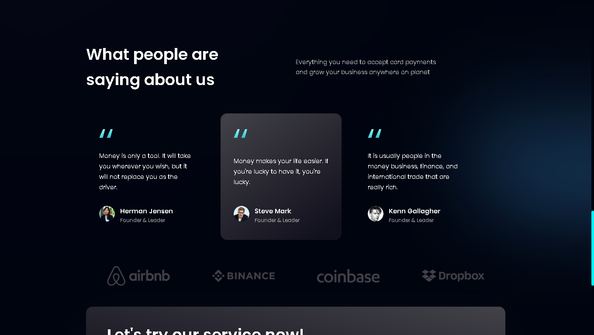

<div align="center" id="top">
  

&#xa0;

  <!-- <a href="https://bank_modern_app.netlify.app">Demo</a> -->
</div>

<h1 align="center">Modern Bank App</h1>

<p align="center">
  

  

  

  

  

  

  
</p>

Status

<h4 align="center">
	<!-- 🚧  Bank_modern_app 🚀 Under construction...  🚧 -->
	✔️  Bank_modern_app 🚀 Was complete...  ✔️
</h4>

<hr>

<p align="center">
  <a href="#dart-about">About</a> &#xa0; | &#xa0;
  <a href="#sparkles-features">Features</a> &#xa0; | &#xa0;
  <a href="#rocket-technologies">Technologies</a> &#xa0; | &#xa0;
  <a href="#camera-screenshots">Screenshots</a> &#xa0; | &#xa0;
  <a href="#white_check_mark-requirements">Requirements</a> &#xa0; | &#xa0;
  <a href="#checkered_flag-starting">Starting</a> &#xa0; | &#xa0;
  <a href="#memo-license">License</a> &#xa0; | &#xa0;
  <a href="https://github.com/AlexMarquesAlves" target="_blank">Author</a>
</p>

<br>

## :dart: About

Modern UI/UX website using Vite with React.js & Tailwind CSS

## :sparkles: Features

:heavy_check_mark: Navbar;\
:heavy_check_mark: Hero;\
:heavy_check_mark: Stats;\
:heavy_check_mark: Business;\
:heavy_check_mark: Billing;\
:heavy_check_mark: Card Deal;\
:heavy_check_mark: Testimonials;\
:heavy_check_mark: Clients;\
:heavy_check_mark: CTA;\
:heavy_check_mark: Footer;

<!-- :heavy_check_mark: Feature 3; -->

## :rocket: Technologies

The following tools were used in this project:

- [React](https://pt-br.reactjs.org/)
- [TailwindCss](https://tailwindcss.com/)
- [TypeScript](https://www.typescriptlang.org/)
- [Vite](https://vitejs.dev/)

&#xa0;

## :camera: Screenshots

<p align="center">Some screenshots took to this project:</p>

<div align="center" id="top">
  &#xa0;
  &#xa0;
  &#xa0;
  &#xa0;
  &#xa0;
  &#xa0;

&#xa0;

</div>

## :white_check_mark: Requirements

Before starting :checkered_flag:, you need to have [Git](https://git-scm.com) and [Node](https://nodejs.org/es/) installed.

## :checkered_flag: Starting

```bash
# Clone this project
$ git clone https://github.com/AlexMarquesAlves/bank_modern_app

# Access
$ cd bank_modern_app

# Install dependencies
$ yarn

# Run the project
$ yarn start

# The server will initialize in the <http://localhost:3000>
```

## :memo: License

This project is under license from MIT. For more details, see the [LICENSE](LICENSE.md) file.

Made with :heart: by <a href="https://github.com/AlexMarquesAlves" target="_blank">¡Duque</a>

&#xa0;

<a href="#top">Back to top</a>
